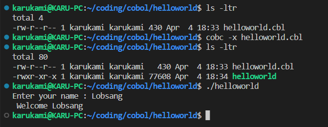

# hellocobol
COBOL hello world progam for testing dev environments.

### Environment example:
* Host: Win10 64bit
* WSL + Ubuntu
* gnucobol
* VSCode + WSL & Cobol syntax highlighting extensions

### Compilation and execution example:

